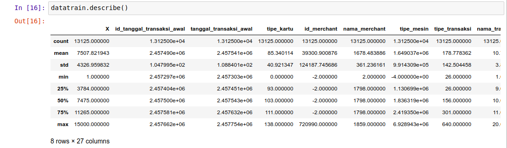
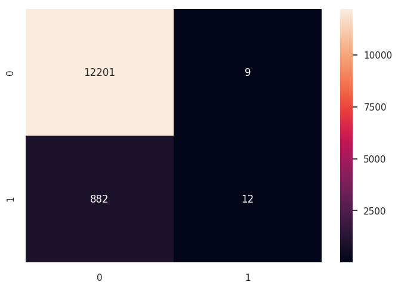

# Learning how to process data
 This repo maybe not a good / right solution for the case that explain here. However, this repo is used to know step by step to process data. Thanks

## Step
1. Basic Terms and Definitions
    1. Data Structures, Types and Values
1. praprocessing
    1. preparing the preparation
    1. Exploratory Data Analysis
    1. Scalling data
    1. Dealing with Missing Values
    1. Dealing with Outliers
    1. Dealing with Imbalanced Data
    1. Data Transformations
    1. Finishing Touches & Moving Ahead
    1. Choosing feature
1. process
1. Validation
1. summary and conclutions


## Metode
1. Basic Term 
    1. Data Structures
    1. Data Types
        1. nominal (qualitative)
        1. ordinal (quantitative)
        1. interval (quantitative)
        1. ratio/scale (quantitative)
    1. Values
        1. decimal
        1. integer
        1. boolean
        1. date/time/time stamp
        1. string
1. Praprocessing
    1. Exploration
    1. Scalling
        1. Rescale data.
        1. Standardize data.
        1. Normalize data.
        1. Binarize data.
    1. Missing Values
        1. delete row (with nan val)
        1. average nan from global value
        1. predict 
    1. Outliers
    1. Imbalance Data
        1. upsampling
        1. downsampling
    1. Data Transformation
    1. Feature Selection
1. Process
    1. Logistic Regression
    1. Decision Tree
    1. Random Forest
    1. Neural Networks
1. Validation
    1. ROC
    1. AUC
    1. Confusion matrix
1. Summary & Conclution


## How to run project
1. Setup environment
```commandline
virtualenv -p python3 venv
source venv/bin/activate
pip install -r req.txt
```
2. run project
```commandline
jupyter notebook
```
3. open [Fraud_process.ipynb](Fraud_process.ipynb) 

## Image
1. Data


1. Exploration


1. Outliers


1. Imbalance


1. Feature Selection


1. Validation




## Refference
1. Basic Terms and Definitions
    1. https://towardsdatascience.com/data-preprocessing-for-non-techies-basic-terms-and-definitions-ea517038a4e5
1. praprocessing : preparing the preparation
    1. http://scikit-learn.org/stable/modules/preprocessing.html
    1. https://github.com/pandas-dev/pandas/blob/master/doc/cheatsheet/Pandas_Cheat_Sheet.pdf
    1. https://www.kaggle.com/ekami66/detailed-exploratory-data-analysis-with-python
    1. https://www.kdnuggets.com/2017/06/7-steps-mastering-data-preparation-python.html/2
    1. https://github.com/pandas-profiling/pandas-profiling
    1. https://machinelearningmastery.com/prepare-data-machine-learning-python-scikit-learn/
    1. https://www.geeksforgeeks.org/data-preprocessing-machine-learning-python/
    1. https://www.analyticsvidhya.com/blog/2016/07/practical-guide-data-preprocessing-python-scikit-learn/
    1. https://medium.com/open-machine-learning-course/open-machine-learning-course-topic-1-exploratory-data-analysis-with-pandas-de57880f1a68
    1. https://github.com/ajaymache/data-analysis-using-python
1. praprocessing : scalling data
    1. https://machinelearningmastery.com/prepare-data-machine-learning-python-scikit-learn/
    1. https://machinelearningmastery.com/rescaling-data-for-machine-learning-in-python-with-scikit-learn/
    1. http://scikit-learn.org/stable/auto_examples/preprocessing/plot_scaling_importance.html
    1. http://scikit-learn.org/stable/modules/preprocessing.html
1. praprocessing : Dealing with Missing Values
    1. https://clevertap.com/blog/how-to-treat-missing-values-in-your-data-part-i/
    1. https://clevertap.com/blog/how-to-treat-missing-values-in-your-data-part-ii/
    1. http://pandas.pydata.org/pandas-docs/stable/missing_data.html
    1. http://scikit-learn.org/stable/modules/preprocessing.html#imputation-of-missing-values
    1. KNN https://towardsdatascience.com/the-use-of-knn-for-missing-values-cf33d935c637
    1. KNN sklearn https://github.com/scikit-learn/scikit-learn/pull/9212
    1. KNN keagle https://www.kaggle.com/dan195/knn-imputation-gbregression-an-plsregression
1. praprocessing : Dealing with Outliers
    1. https://www.kdnuggets.com/2017/02/removing-outliers-standard-deviation-python.html
    1. https://medium.com/@dhwajraj/learning-python-regression-analysis-part-7-handling-outliers-in-data-d36ee9e2130b
    1. https://www.kaggle.com/general/24617
1. praprocessing : Dealing with Imbalanced Data
1. praprocessing : Feature selection
    1. https://www.kaggle.com/kanncaa1/feature-selection-and-data-visualization
    1. https://machinelearningmastery.com/feature-selection-in-python-with-scikit-learn/
    1. https://machinelearningmastery.com/feature-selection-machine-learning-python/
    1. https://towardsdatascience.com/a-feature-selection-tool-for-machine-learning-in-python-b64dd23710f0